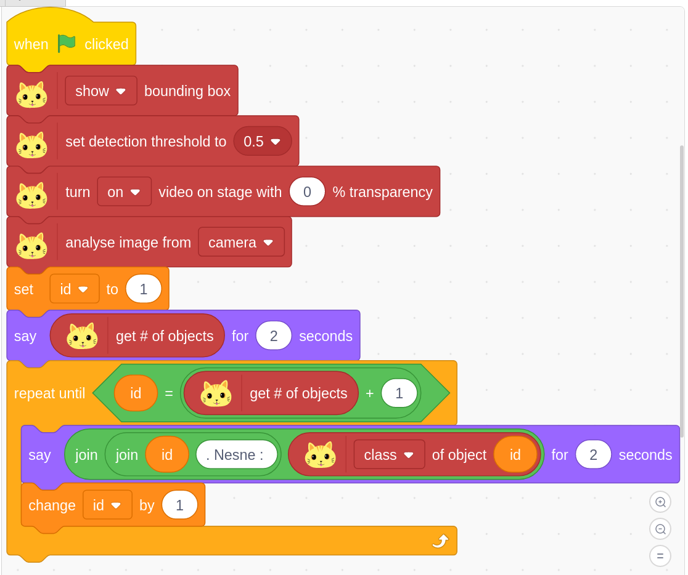

## **Programın Açıklanması**

1. Programda nesne tespitinde kutulama işlemi aktifleştirilir.
2. Güven aralığı olarak 0.5 olarak ayarlanır.
3. Kamera görüntüsü sahneye yansıtılır.
4. Kameradan gelen görüntü analiz edilir.
5. **`id`** değişkenine **`1`** atanır.
6. Tespit edilen nesne sayısı 2 saniye boyunca ekranda gösterilir.
7. **`id`** değeri tespit edilen nesne sayısının **`1`** fazlasına ulaşınca
döngü tamamlanır.Örneğin ekranda nesne tespit edilmediğinde **`id == 1`** olduğu
için döngü içerisine girmeden program sonlanır.  
İki nesne tespit edildiğini farz edelim , **`id < 3`** olduğu için döngü
içerisine girer ve **`1`** id değeri atanmış nesneye karşılık gelen ismi 
**1.Nesne: <Nesne Adı>** olacak biçimde ekrana bildirir.
8. **`id`** değeri **`1`** artırılır.

Program **`id`** değeri tespit edilen nesne sayısına ulaşıncaya kadar döngü 
tekrarlanır.

https://github.com/user-attachments/assets/a7564cb6-1911-4fb8-b00e-895219d46315

